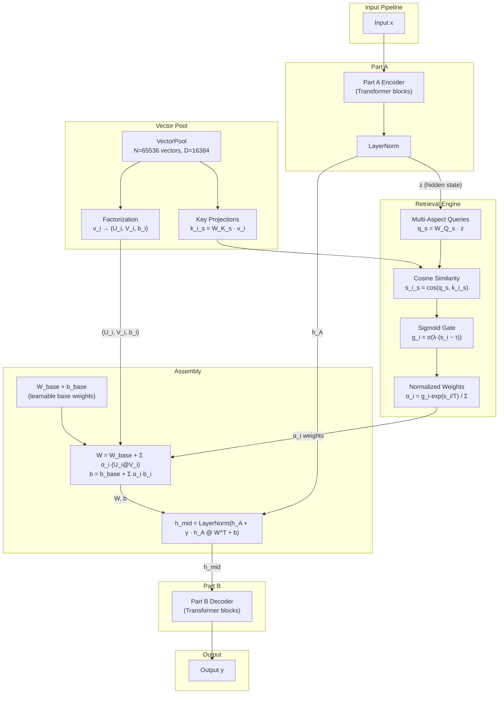
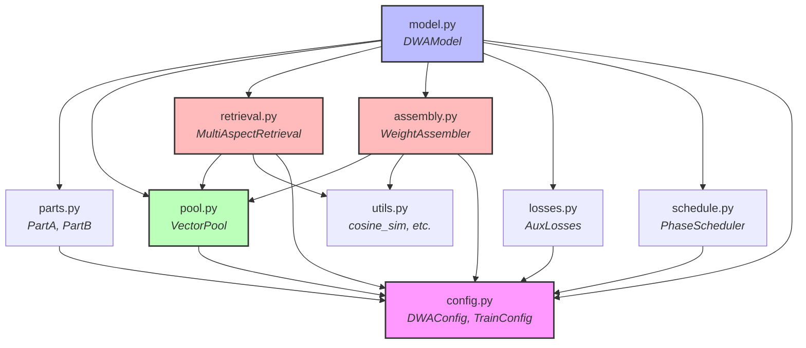
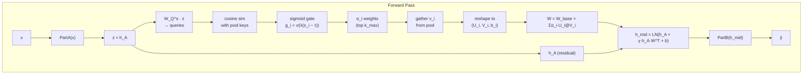
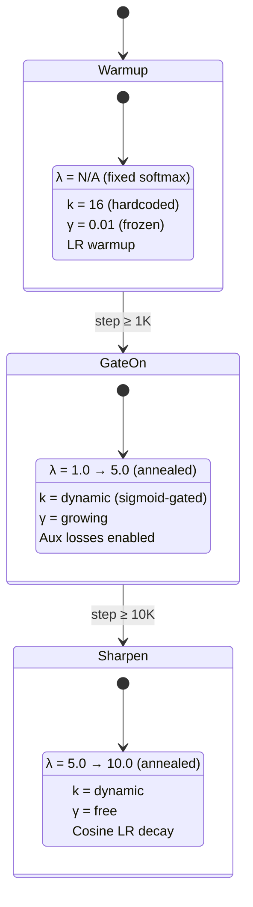
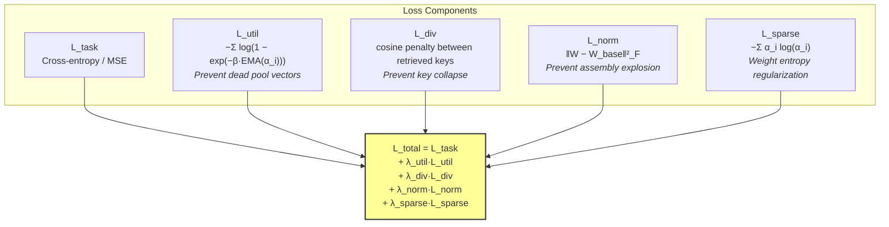
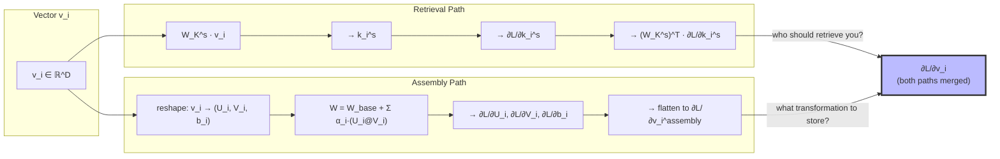
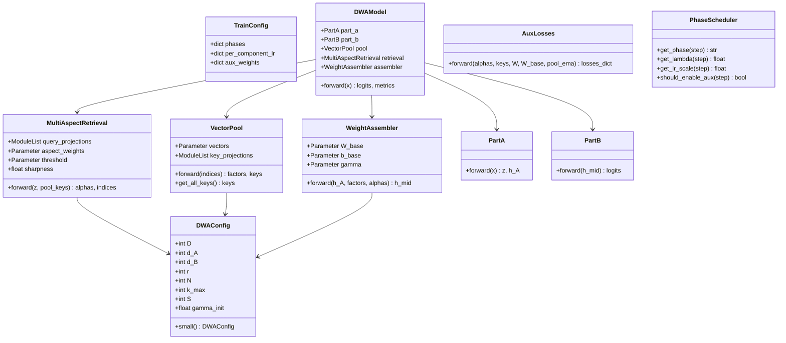

# Dynamic Weight Assembly (DWA) — Project Architecture

## 1. High-Level System Architecture

One model split into two halves. The middle layer weight matrix is dynamically assembled from a pool of vectors per input. Part A produces a query → retrieves relevant vectors → vectors are reshaped into low-rank matrix factors → assembled middle layer → Part B generates output.



## 2. Module Dependency Graph



## 3. Forward Pass Data Flow



## 4. Training Pipeline — Three-Phase Schedule



| Phase | Steps | λ | k | γ | Notes |
|-------|-------|---|---|---|-------|
| 1 — Warmup | 0–1K | N/A (fixed top-16) | 16 fixed | 0.01 | Softmax over top-16, warmup LR |
| 2 — Gate On | 1K–10K | 1.0 → 5.0 | dynamic | growing | Enable sigmoid gate, aux losses |
| 3 — Sharpen | 10K+ | 5.0 → 10.0 | dynamic | free | Sharper selection, cosine decay |

## 5. Auxiliary Losses



## 6. Dual Gradient Path — Key Innovation

Both retrieval and assembly gradients flow through the **same** pool vectors, creating a self-reinforcing loop: retrieval shapes what gets stored, and storage shapes what gets retrieved.



## 7. Class Hierarchy



## 8. Module Responsibilities

| Module | File | Responsibility |
|--------|------|----------------|
| **Config** | `config.py` | `DWAConfig` (model hyperparams) and `TrainConfig` (phase schedule, per-component LR, aux loss weights). Single source of truth — all modules derive dimensions/defaults from here. |
| **VectorPool** | `pool.py` | Stores the N×D parameter matrix and S key projection heads. Handles vector gathering by indices and key computation for all pool vectors. The dual-gradient convergence point — both retrieval and assembly gradients update `vectors`. |
| **MultiAspectRetrieval** | `retrieval.py` | Computes S aspect queries from Part A hidden state, cosine similarity against pool keys, sigmoid-gated selection with learnable threshold τ and annealed sharpness λ. Returns normalized α weights and selected indices. |
| **WeightAssembler** | `assembly.py` | Reshapes retrieved vectors into (U, V, b) factors, assembles W and b via weighted sum with base weights, and computes the residual connection `h_mid = LN(h_A + γ·h_A@W^T + b)`. Owns W_base, b_base, γ. |
| **PartA / PartB** | `parts.py` | Standard Transformer encoder stacks. Part A produces the hidden state z and h_A; Part B consumes h_mid and produces output logits. Architecture-agnostic — can be any seq2seq backbone. |
| **DWAModel** | `model.py` | Top-level `nn.Module` orchestrating the full forward pass: PartA → retrieval → assembly → PartB. Returns logits + auxiliary metrics dict. Wires the dual-gradient path. |
| **AuxLosses** | `losses.py` | Computes all four auxiliary losses (util, div, norm, sparse) plus the task loss weighting. Takes α weights, retrieved keys, assembled W, W_base, and pool EMA as inputs. |
| **PhaseScheduler** | `schedule.py` | Controls the three-phase training schedule: warmup → gate on → sharpen. Manages λ annealing, k switching, aux loss gating, and per-component LR scaling. Stateless except for config. |
| **Utils** | `utils.py` | Shared math utilities: cosine similarity, normalization, EMA tracking. No state, pure functions. |

## 9. File Structure

```
matrix/
├── src/
│   └── dwa/
│       ├── __init__.py              # Package exports
│       ├── config.py                # DWAConfig, TrainConfig dataclasses
│       ├── pool.py                  # VectorPool (N×D parameter storage)
│       ├── retrieval.py             # MultiAspectRetrieval (sigmoid-gated)
│       ├── assembly.py              # WeightAssembler (factorization + assembly)
│       ├── parts.py                 # PartA, PartB (Transformer halves)
│       ├── model.py                 # DWAModel (top-level nn.Module)
│       ├── losses.py                # AuxLosses (util, div, norm, sparse)
│       ├── schedule.py              # PhaseScheduler (3-phase training logic)
│       └── utils.py                 # cosine_similarity, normalize, etc.
├── tests/
│   ├── conftest.py                  # Shared fixtures (small config, model instances)
│   ├── test_config.py               # Config validation / defaults
│   ├── test_pool.py                 # VectorPool indexing, reshape, gradients
│   ├── test_retrieval.py            # Cosine sim, sigmoid gate, top-k
│   ├── test_assembly.py             # Factorization, W assembly, residual
│   ├── test_model.py                # End-to-end forward/backward, shapes
│   ├── test_losses.py               # Each aux loss independently
│   └── test_schedule.py             # Phase transitions, λ annealing
├── train.py                         # Training entry point (argparse → Trainer)
├── main.py                          # CLI entry point
├── docs/
│   ├── ARCHITECTURE.md              # Algorithm & math spec
│   ├── PROJECT_ARCHITECTURE.md      # This file — project architecture & diagrams
│   ├── TPU_TRAINING_STRATEGY.md     # TPU training optimization strategy
│   ├── CLAUDE.md                    # Behavioral guidelines
├── pyproject.toml                   # Project metadata & dependencies
└── README.md                        # Project overview
```

## 10. Design Principles

| Principle | Decision |
|-----------|----------|
| **Config-driven** | Single `DWAConfig` dataclass — everything derives from it; `DWAConfig.small()` for fast iteration |
| **Separation of concerns** | `pool.py` = storage, `retrieval.py` = selection, `assembly.py` = construction — each independently testable |
| **Dual-gradient transparency** | Both gradient paths flow through `VectorPool.vectors` — no manual gradient wiring needed, PyTorch autograd handles it |
| **Phase-aware training** | `PhaseScheduler` controls λ annealing, k switching, aux loss gating — no if/else scattered in model code |
| **Testability** | Every module has isolated shape/gradient tests; `small()` config runs full forward+backward in <1s |
| **Per-component LR** | `TrainConfig.per_component_lr` → optimizer param groups, not hardcoded |

## 11. Dimensionality Reference

| Parameter | Value | Notes |
|-----------|-------|-------|
| D (vector dim) | 16384 ≈ 2^14 | Close to ~16000 |
| d_A, d_B (hidden) | 256 | Symmetric, power of 2 |
| r (assembly rank) | 24 | Polysemantic meaning slots per vector |
| S (retrieval aspects) | 4 | Multi-facet matching |
| N (pool size) | 65536 | ~1.07B params in pool alone |
| k_max (retrieved) | 16 | Effective rank = 16×24 = 384 > 256 ✓ |

**Small validation config**: D=2048, d_A=d_B=64, r=4, N=512, k_max=8, S=2

## 12. Novelty vs Prior Work

| Work | What it does | DWA difference |
|------|-------------|---------------|
| PKM | Sum retrieved embeddings | Assemble into **weight matrices** |
| LoRA | Fixed low-rank adaptation | Dynamically **retrieved** per input |
| HyperNetworks | Generate weights from scratch | From **retrievable pool** — interpretable, modular |
| MoE | Route to full expert networks | Low-rank vector **fragments** — 1000× smaller |
| RAG | Retrieve text, prepend to context | Knowledge **IS** the computation (weight deltas) |